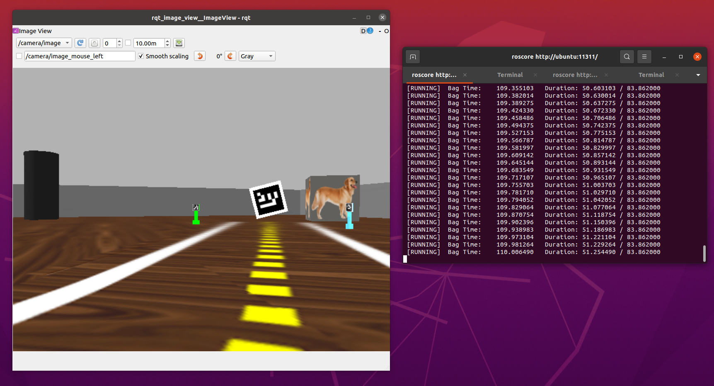
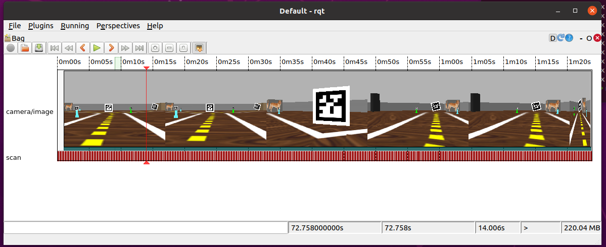

# Rosbag 

Em robótica é muito comum trabalhar com arquivos de *replay* de inputs sensoriais.

Tipicamente é usado para que seja possível desen

Fonte: [ROS Robot Programming](https://www.robotis.com/service/download.php?no=719), seção 5.4.8.

## Para gravar um sensor específico 

Por exemplo, para gravar o input de câmera do Turtlebot dentro do Gazebo

    rosbag record /camera/image  /scan

O ROS vai gravar um arquivo que termina com a extensão *bag* e cujo nome é baseado na data atual. Exemplo: `2021-05-13-10-36-22.bag`.

Se você quiser especificar o nome do arquivo de saída, use a opção `-O nome_do_arquivo`. 

## Gravar os sensores

Para gravar o input de **todos os sensores**: 

    rosbag record -a

## Consultar um bag file 

    rosbag info  ___.bag

## Para fazer um replay e republicar os tópicos

Durante o replay **os tópicos são republicados**, como se houvesse um robô real ou simulação rodando.

Para fazer um replay precisamos ter um sistema *ROS* rodando: 

    roscore

E para fazer o *replay* de fato: 

    rosbag play 2021-05-13-10-36-22.bag 

**Atenção:** Troque o nome `2021-05-13-10-36-22.bag` pelo nome do seu arquivo *bag*. 

Durante o *replay*, os tópicos dos sensores recebem a informação que foi para o *bag file*.

Note que o `rqt_image_view` recebe as imagens como se o *Gazebo* estivesse rodando. 

## Comprimir e descomprimir 

    rosbag compress 021-05-13-10-36-22.bag

Depois de compactar, o arquivo antes de compactar aparecerá com `orig`  no nome.

    rosbag decompress 

## Ferramenta de visualizar - rqt bag

Rodar o comando: 

    rqt

No menu, selecionar *Plugins* - *Logging* - *Bag*.

Depois, no ícone que existe no canto superior esquerdo pode-se selecionar o qual rosbag visualizar

